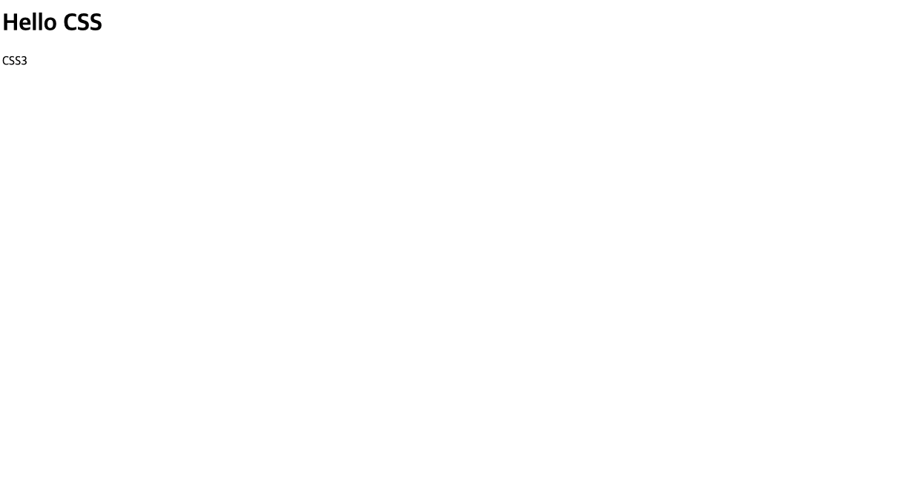
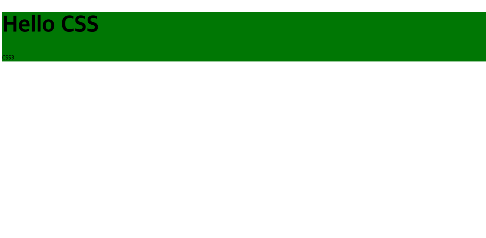
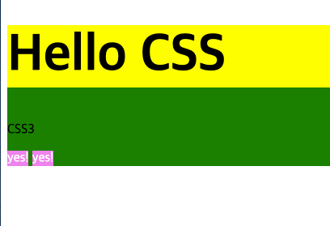

# TIL 2021-03-05

## 오늘 배운 내용

---

- css 작성 방법
- 박스모델 이해하기
- class 와 id 

## CSS ( cascading style sheet )

css 는 html 문서가 실제로 보여지게 되는 스타일을 작성하는 언어다. <br>
즉 문서를 시각적으로 꾸며주는 역할을 한다. <br>

솔직히 css 도 쉬우면서 어렵다. <br>
접근하기는 쉬운데 뒤로갈수록 어렵다니.. 내가 실무에 있었을 당시 얻은걸로는 택도 없을 만큼 해야할게 많았다. <br>
그래서 어려운것보단 오늘은 css 의 기초에 대해 기록해보려한다. <br><br>


```html
<!DOCTYPE html>
<html>
<head>
<title>what is CSS</title>
</head>
 <body>
    <div>
        <h1>Hello CSS</h1>
        <p>CSS3</p>
    </div>    
 </body>
</html>
```
여기 HTML 문서가 있다. <br>
이 html을 화면으로 본다면 어떻게 보이는지 확인해보자.




보는 바와 같이 잘 나온것 같다. <br>
그런데 너무 밋밋하다. 이것을 꾸며주려면 이렇게 해본다.<br><Br>

```css

div{
    background:green;
}

h1{
    font-size:4rem;
}
```



보는 바와 같이 예쁘진 않지만 변화가 생겼다. <br><br>

이제 스타일시트가 어떻게 작동하는지 살펴보자 <br><br>

```css
/* div 는 셀렉터라 한다. */
div {
    /* 선언블록 */
    /* background : 프로퍼티 */
    /* green : 프로퍼티 값 */
    /* ; : 선언 구분자 */
}

```

- div 는 셀렉터가 되고 이것으로 html 엘리먼트를 선택한다.
- background 는 프로퍼티이며 어떤 스타일을 줄것인지 알려준다.
- green 은 프로퍼티 값이며 이것으로 스타일을 적용시킨다. 
- ; 은 선언 구분자로 한줄의 스타일을 끝내는 것이다. 

## 박스모델

html 에서 모든 컨텐츠는 고유한 영역을 가진다. <br>
자주 보인 div 태그도 고유 영역을 가진다. 


이 이미지에서 초록색 영역이 div만의 영역이라는 뜻이다. <br><br>

- 박스는 항상 사각형이고 width 와 height 를 가진다. <br>
- 이후 css 로 모양을 잡아줄 수 있다.
  

### inline , block 의 차이

박스모델이 사각형인 건 알았으나 block , 과 inline 이라는 두개의 박스로 나뉜다. <br>



잘보면 각각 차지하는 영역이 색으로 구분되어 있다. <br><br>

<p style="color:yellow;font-weight:bold;">h1</p> <br>

h1 은 한줄을 차지 하고 있다. 이것이 block 이다. <br>
자기 자신 이외에는 아무것도 둘 수 없다.

<p style="color:violet;font-weight:bold;">span</p> <br>

span 은 나란히 다른 엘리먼트가 오고있다. 이것이 inline 이다. <br>
자기 자신 이외에 inline 요소들을 옆에 둘 수 있다.

## class 와 id 

만약 css를 태그로 작성했을때 생기는 문제가 무엇일까 ? <br>
그것은 태그가 중복되면 덮어 쓴다는 것과 어떤 태그에 스타일을 적용했는지 구분할 수 가 없어진다는 점이다. <br><br>

이것을 피하기 위해 css 는 class 와 id 가 있다. <br>
둘의 사용법은 이러하다.

```html
<div id="container"0>
    <h1 class="title">Hello CSS</h1>
    <p class="info">CSS3</p>
</div>    
```
이렇게 태그 옆에 class 명과 id 명을줘 태그에 이름을 줄 수 있다.<br>
그리고 css 에서 셀렉트할땐 이렇게 한다.

```css
#container{
    width:500px;
    height:auto;
}

.title{
    font-size:4rem;
}

.info{
    font-size:1.2rem;
}
```

이렇게하면 어떤 엘리먼트에 스타일을 주었는지 명확해 질 수 있다. 

- 주의 사항
  
  >  id 는 class 보다 우선순위를 지닌다. <br>