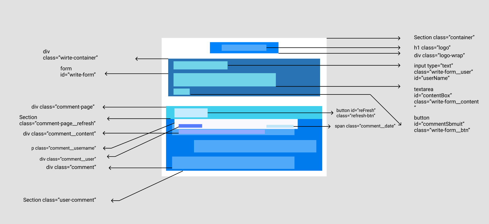

# TIL 2021-03-15

## 오늘 배운 내용

---

- 와이어프레임
- 와이어프레임을 보고 HTML 을 작성할 수 있다.
  
  


## 와이어프레임

와이어프레임은 레이아웃을 구성하는 방법중 하난데,  <br>
대략 어떤 위치로 무엇이 들어가야할지 구조를 설계한다.<br>

이런 경우 와이어프레임이라고 볼 수 있다.<br><br>




이중 컬러가 들어간 박스들이 모두 레이아웃을 만들기 위한 작업이다. <br><br>

그리고 화살표로 나와있는 부분이 <br>
class , tag , id 를 어떻게 줄 지 표현한 것이다.<br><br>

실제로 이렇게 작업하고 코드로 옮기면 굉장히 수월하다. 


## HTML 작업

실제 와이어프레임을 보고 코드로 옮기기만 하면 레이아웃 위치를 잡는것은 매우 쉽다. <br>

제일 상단부터 차례대로 감싸져 가는 방식으로 코드를 짜면 되겠다.

```html
    <section class="container">
      <div class="logo-wrap">
        <a href="#">
          
          <h1 class="logo">Twittler</h1>
        </a>
      </div>
      <div class="write-container">
        <h2 class="write-local-user">
          <a href="#" class="hash-tag">#서동혁</a>님의 트윗
        </h2>
        <h3 id="write-title">오늘 하루는 어땠나요 ?</h3>
        <form id="write-form" method="POST" action="/comment/postTwitt">
          <input type="text" class="write-form__user" id="userName" placeholder="your name"/>
          <textarea id="contentBox" class="write-form__content" placeholder="내용을 입력해주세요"></textarea>
          <button id="commentSubmit" class="write-form__btn">Register</button>
        </form>
      </div>
      <div class="comment-page">
        <section class="comment-page__refresh">
          <button id="reFresh" class="refresh-btn">             
              Refresh
          </button>
        </section>
        <section class="user-comment">
          <div class="comment">
            <div class="comment__user">
              <p class="comment__username">satya</p>
              <span class="comment__date">2019-01-04 18:30:20</span>
            </div>
          </div>
        </section>
      </div>
    </section>

```

조금 길지만 정말 대략적인 코드를 옮긴것이다. <br>
와이어프레임을 사용하면 어느정도 가볍게 구조를 파악할 수 있다는 점이 포인트다.